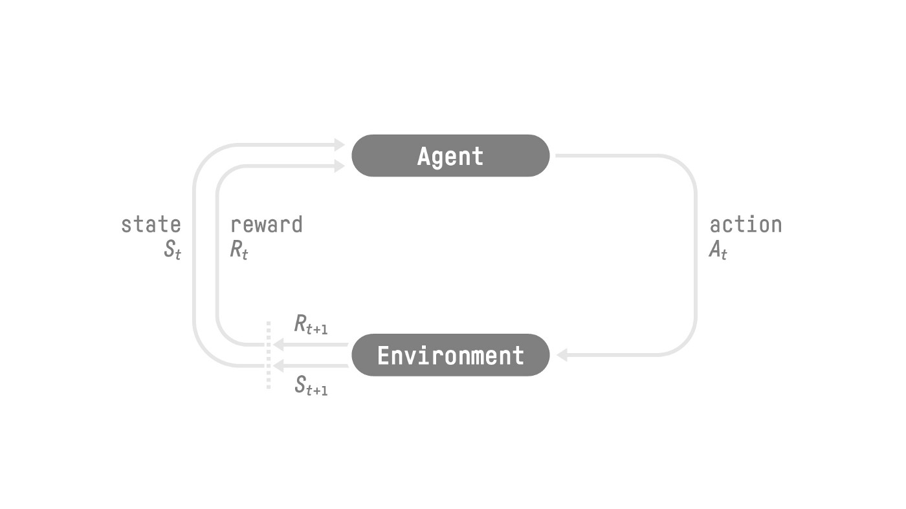

# Markov Decision Process(MDP)

생성일: 2025년 7월 6일 오전 10:58

**link:** https://huggingface.co/learn/deep-rl-course/unit1/introduction

# 1. What is Reinforcement Learning?

---

## **1. 큰 맥락에서의 개념**

- Agent인 AI가 시행착오를 통해 환경과 상호 작용을 하고 작업 수행에 대한 feedback으로 reward인 부정 또는 긍정을 받음으로써 환경으로부터 학습하는 것이다.
    - 행동으로부터 학습하는 계산적 접근 방식인 것이다.

## 2. 공식적인 정의

- 환경으로부터 학습하는 agent를 구축하여 control task을 해결하기 위한 framwork이다.
    - 여기서 ‘환경으로부터 학습’이란 시행착오를 통해 환경과 상화 작용하고 고유한 feedback으로 positive 또는 negative reward을 받는 방식이다.
    - Reinforcement learning is a framework for solving control tasks (also called decision problems) by building agents that learn from the environment by interacting with it through trial and error and receiving rewards (positive or negative) as unique feedback.

# 2. The Reinforcement Learning Framework

---

## 1. The RL Process

The RL Process: a loop of state, action, reward and next state

- 다음 그림처럼 RL loop는 state, action, reward를 진행하고 다음 state를 반복하는 방식으로 진행한다.
    
    
    
- Agent의 목표는 expected return인 cumulative reward을 최대화하는 것이다.

## 2. The reward hypothesis: the central idea of Reinforcement Learning

- RL은 모든 목표가 expected cumulative reward의 최대화로 설명될 수 있다는 reward hypothesis을 기반으로 한다.
- 그렇기 때문에 강화학습에서는 최상의 행동을 하기 위해 expected cumulative reward을 최대화하는 행동을 취하는 방법을 학습하는 것을 목표로 한다.

## 3. Markov Property

- 논문에서는 RL process를 Markov Decision Process(MDP)라고 한다.
- 해당 속성을 RL측면으로 설명하면 agent가 어떤 결정을 할 때 현재 상태만 필요하고 이전에 취한 모든 상태와 조치의 기록이 필요하지 않다는 것이다.

## 4. Observations/States Space

- Observation과 State는 agent가 환경으로부터 얻는 정보를 의미한다.
    - 비디오 게임의 경우 screenshot과 같은 frame일 수 있다.
    - 거래 대리인의 경우 특정 주식의 가치 등이 될 수 있다.
- State란 완전히 관찰된 환경에서 world에 대한 숨겨진 정보가 없는 완전한 설명을 의미한다.
- Observation은 부분적으로 관찰된 환경에서 상태에 대한 부분적인 설명을 의미한다.
    
    
    

## 5. Action Space

- 환경에서 가능한 모든 action의 집합을 의미한다.
    - 이 개념은 향후 RL 알고리즘을 선택할 때 중요하다.
- Action에 대하여 discrete한 것도 있고, continuous한 것도 있다.
    - Discrete space
        - 가능한 action의 수가 유한하다.
        - 슈퍼 마리오를 예로 들면, 왼쪽, 오른쪽, 위, 아래의 4가지 동작만 가능하다.
    - Continuous space
        - 가능한 동작의 수가 무한하다.
    
    
    

## 6. Rewards and the discounting

- Reward는 agent에 대한 유일한 feedback이기 때문에 RL에서 기본이다.
- 각 시간 단계 t의 cumulative reward은 다음과 같이 작성할 수 있다.
    
    
    
    The cumulative reward wquals the sum of all rewards in the sequence
    
    - 하지만 단순히 이렇게 더하면 ‘먼 미래의 보상은 불확실성이 비교적 높다’는 사실을 반영하지 못한다.
    - 따라서 discount rate를 적용하여 cumulative reward를 계산한다.
- Discount rate
    - $\gamma$를 이용하여 정의한다.
    - $\gamma$가 클수록 discount는 작아진다.
        - 이는 agent가 장기적인 보상에 더 신경을 쓴다는 것이다.
    - $\gamma$가 작을수록 discount는 커진다.
        - 이는 agent가 단기 보상에 더 신경을 쓴다는 것이다.
    - 각 reward는 $\gamma$에 의해 timestep별로 지수로 변화한다.
        - Time step이 증가하면서 미래의 보상이 발생할 가능성은 점점 줄어들기 때문이다.
    
    
    

# 3. The type of tasks

---

## 1. Task의 종류

- Task는 강화 학습 문제의 instance이다.
1. Episodic task
    - Starting point와 Ending point로 이루어진 episode를 만든다.
        - 이때 State, Action, Reward, New State로 구성된다.
    - 슈퍼 마리오로 예를 들면, 죽거나 마지막 단계에 도달하면 끝난다.
2. Continuing tasks
    - 영원히 지속된다.
    - Agent는 최상의 작업을 선택하는 동시에 환경과 상호 작용하는 방법을 학습해야 한다.
        - Agent가 종료할 때까지 계속 진행되는 것이다.

# 4. The Exploration/ Exploitation tradeoff

---

## 1. Exploration(탐색)

- 환경에 대한 자세한 정보를 찾기 위해 무작위 작업을 시도하여 환경을  탐색하는 것이다.

## 2. Exploitation(악용)

- 보상을 극대화하기 위해 알려진 정보를 악용하는 것이다.

## 3. Tradeoff

- 가까운 작은 보상의 정보만 악용하여 보상을 높일 수 있지만 탐색을 진행하면 더 큰 보상을 알 수 있다.
    - 이를 exploration/exploitation trade-off라고 한다.
- 환경을 얼마나 많이 탐구하고 환경에 대해 알고 있는 것을 얼마나 활용하는지의 균형을 맞춰야 한다.
    - 이러한 tradeoff를 처리하는 데 도움이 되는 규칙을 정의해야 한다.
- 정리하면, Exploitation를 통해 매일 좋다고 알고 있는 같은 식당에 가서 다른 더 좋은 식당을 놓칠 위험을 감수해야 한다. 하지만 Exploration을 통해 나쁜 경험을 할 위험은 있지만 환상적인 경험을 할 수 있는 기회를 가지고 전에 가본 적이 없는 식당을 알 수 있다.
    
    
    

# 5. The two main approaches for solving RL problems

---

## 1. 필요성

- Expected cumulative reward을 최대화하는 작업을 선택할 수 있는 RL agent를 어떻게 구축할 수 있는지 알아야 한다.

## 2. The Policy $\pi$: the agent’s brain

- 처한 상태에서 어떤 조치를 취해야 하는지 알려주는 기능이다.
- 주어진 time에 agent의 동작을 정의한다.
    
    
    
- Policy는 우리가 배우고자 하는 기능이다.
    - 우리의 목표는 agent가 이에 따라 행동할 때 expected reward을 극대화하는 policy인 최적의 policy $\pi^*$을 찾는 것이다.
    - 이는 training을  통해 찾는다.
- Training 방법 두 가지
    - Policy-Based Methods
        - 직접적으로, agent에게 현재 상태에서 어떤 조치를 취해야 하는지 배우도록 교육하는 것이다.
    - Value-Based Methods
        - 간접적으로, agent에게 어떤 상태가 더  가치 있는지 학습한 다음 더 가치 있는 상태로 이어지는 조치를 취하도록 교육하는 방식이다.

### 1. Policy-Based Methods

- Policy function을 직접 학습한다.
    - 이 function은 각 상태에서 최상의 해당 동작으로의 매핑을 정의한다.
        - 또는 해당 상태에서 가능한 작업 집합에 대한 확률 분포를 정의할 수 있다.
- Two types of policies
    - Deterministic
        - 지정된 상태의 policy은 항상 동일한 작업을 반환한다.
        
        
        
    - Stochastic
        - 행동에 대한 확률 분포를 출력한다.
        - 초기 상태가 주어지면 stochastic policy은 해당 상태에서 가능한 행동에 대한 확률 분포를 출력한다.
        
        
        

### 2. Value-Based methods

- Policy function을 학습하지 않고, 해당 상태에 있는 expected value에 매핑하는 value function을 학습한다.
- The value of a state
    - Agent가 해당 상태에서 시작하여 policy에 따라 행동할 경우 얻을 수 있는 expected discounted return이다.
    - “Act according to our policy”라는 것은 단지 우리의 policy가 “goint to the state with the highest value”라는 것을 의미한다.
- Value function은 가능한 각 state에 대한 value을 정의했음을 알 수 있다.
    
    
    
- Value function 덕분에, 각 단계에서 policy은 value function에 의해 정의된 가장 큰 값을 가진 상태를 선택하여 goal을 달성한다.
    
    
    

# 6. The “Deep” in Deep Reinforcement Learning

---

## 1. 개념

- 심층 강화 학습(Deep Reinforcement Learning)은 강화 학습 문제를 해결하기 위해 심층 신경망(deep neural network)을 도입하여 “deep”이라는 이름을 붙인 것이다.

<aside>
💡

용어: https://huggingface.co/learn/deep-rl-course/unit1/glossary

</aside>